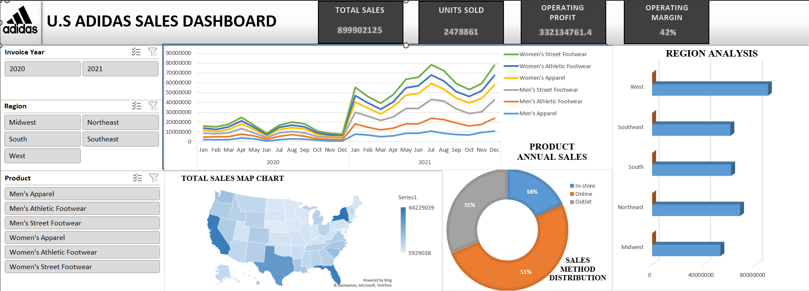

# 📈 Adidas Sales Interactive Dashboard - Microsoft Excel

## Introduction

Welcome to the Adidas Sales Interactive Dashboard project! This interactive dashboard is created using Microsoft Excel and is based on the [Adidas Sales Dataset](https://www.kaggle.com/datasets/heemalichaudhari/adidas-sales-dataset/data) sourced from Kaggle. The project involves data cleaning, integrations, and advanced Excel functions to provide a comprehensive analysis of Adidas sales.

## Adidas Company Overview

Adidas is a multinational corporation founded in Germany, specializing in the design and manufacturing of sports footwear, apparel, and accessories. With a rich history dating back to 1949, Adidas has become a global leader in the sports industry, known for its innovation, quality, and iconic brand.

## Data Cleaning and Integration

The project begins with meticulous data cleaning and integration to handle missing details and ensure a robust dataset for analysis.

## Data Visualizations

### 🗺️ Map Chart - State-wise Total Sales
- A map chart visualizes total sales in the country, providing insights into state-wise sales distribution.

### 📊 Line Chart - Yearly Trends by Product
- The line chart illustrates trends in purchases based on the year and product categories, offering a dynamic view of sales patterns.

### 🥧 Pie Chart - Distribution of Sales Method
- A pie chart showcases the distribution of sales based on the method of purchase, including in-store, online, or outlet transactions.

### 📊 3D Histogram - Sales by Region
- The 3D histogram provides an in-depth analysis of sales region-wise, allowing for a comprehensive understanding of Adidas sales distribution.

**Interactive Dashboard - Using MS Excel**

## Key Metrics 🚀

- Total Sales: $8,999,902,125
- Units Sold: 2,478,861
- Operating Profit: $332,134,761
- Operating Margin Average: 42%

## Trends

- In 2021, all products exhibited an increasing trend, showing a growth of 35% compared to the previous year.
  
- **Top Sales States:**
  - New York, Texas, California, and Florida maintained the highest sales in both 2020 and 2021.

- **Sales Method Shift:**
  - 51% of purchases are now made online, indicating a significant shift compared to sales methods, including outlet and in-store transactions.

- **Regional Sales Analysis:**
  - In regional analysis, the West region of America dominated with the highest sales, while the Midwest region recorded one of the lowest sales figures.

These trends signify a positive growth trajectory in product sales, changes in consumer preferences towards online purchases, and varying sales patterns across different regions.

